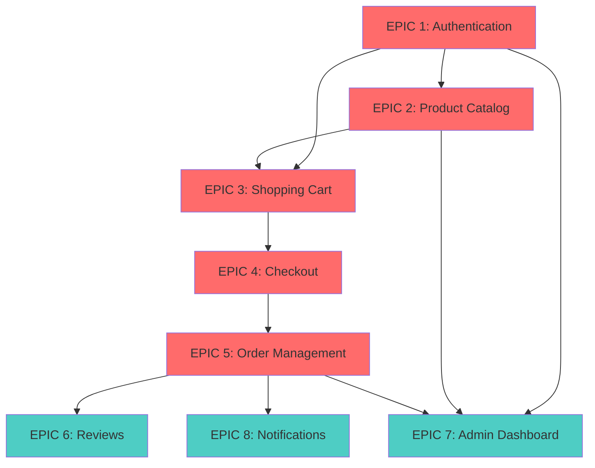

# SRIBEESonline - Project EPICs Overview

> Complete list of all EPICs for the SRIBEESonline e-commerce platform

---

## 📊 EPICs Summary

| EPIC # | Name | User Stories | Priority | Phase |
|--------|------|--------------|----------|-------|
| **1** | User Authentication & Account Management | 6 | High | Phase 1 (MVP) |
| **2** | Product Catalog & Search | 7 | High | Phase 1 (MVP) |
| **3** | Shopping Cart & Wishlist | 7 | High | Phase 1 (MVP) |
| **4** | Checkout & Payment | 7 | High | Phase 1 (MVP) |
| **5** | Order Management | 7 | High | Phase 1 (MVP) |
| **6** | Reviews & Ratings | 5 | Medium | Phase 2 |
| **7** | Admin Dashboard | 10 | Medium | Phase 2 |
| **8** | Notifications & Communication | 5 | Medium | Phase 2 |

**Total**: 54 User Stories across 8 EPICs

---

## 🎯 EPIC 1: User Authentication & Account Management

**Goal**: Enable secure user registration, login, and profile management

**Priority**: High | **Phase**: 1 (MVP) | **Estimated Duration**: 2-3 weeks

### User Stories (6)

- **US-1.1**: As a new user, I want to register an account with email/password so that I can make purchases
- **US-1.2**: As a registered user, I want to log in securely so that I can access my account
- **US-1.3**: As a user, I want to reset my password if I forget it
- **US-1.4**: As a user, I want to update my profile information (name, phone, address)
- **US-1.5**: As a user, I want to manage multiple delivery addresses
- **US-1.6**: As a user, I want to enable two-factor authentication for added security

### Acceptance Criteria
- ✅ Email validation and verification
- ✅ Password strength requirements
- ✅ Secure session management
- ✅ Social login options (Google, Facebook)

### Technical Components
- User Service (Backend)
- Authentication API
- JWT token management
- PostgreSQL user tables
- Redis session storage

---

## 🔍 EPIC 2: Product Catalog & Search

**Goal**: Provide comprehensive product browsing and search capabilities

**Priority**: High | **Phase**: 1 (MVP) | **Estimated Duration**: 3-4 weeks

### User Stories (7)

- **US-2.1**: As a customer, I want to browse products by category so that I can find what I need
- **US-2.2**: As a customer, I want to search for products using natural language in my preferred language (English, Sinhala, Tamil, or Singlish)
- **US-2.3**: As a customer, I want to filter products by price, brand, rating, and availability
- **US-2.4**: As a customer, I want to sort products by relevance, price, popularity, or rating
- **US-2.5**: As a customer, I want to view detailed product information including images, description, price, and reviews
- **US-2.6**: As a customer, I want to see related or recommended products
- **US-2.7**: As a customer, I want to see product availability and stock status

### Acceptance Criteria
- ✅ AI-powered semantic search with Gemini embeddings
- ✅ Multilingual support (English, Sinhala, Tamil, Singlish)
- ✅ Fast autocomplete with popular search suggestions
- ✅ Multi-level category navigation
- ✅ High-quality product images with zoom
- ✅ Real-time stock updates
- ✅ Automatic fallback to keyword search

### Technical Components
- Product Service (Backend)
- Semantic Search Service (Backend)
- Gemini Embedding Service (AI)
- PostgreSQL with pgvector extension
- Redis search cache
- Image storage (AWS S3)

---

## 🛒 EPIC 3: Shopping Cart & Wishlist

**Goal**: Enable users to manage items before purchase

**Priority**: High | **Phase**: 1 (MVP) | **Estimated Duration**: 2 weeks

### User Stories (7)

- **US-3.1**: As a customer, I want to add products to my cart
- **US-3.2**: As a customer, I want to update quantities or remove items from my cart
- **US-3.3**: As a customer, I want to see the total price including taxes and shipping
- **US-3.4**: As a customer, I want to save items to a wishlist for later
- **US-3.5**: As a customer, I want to move items between cart and wishlist
- **US-3.6**: As a customer, I want my cart to persist across sessions
- **US-3.7**: As a customer, I want to apply coupon codes for discounts

### Acceptance Criteria
- ✅ Real-time price calculations
- ✅ Cart persistence (logged-in users)
- ✅ Stock validation before checkout
- ✅ Clear pricing breakdown

### Technical Components
- Cart Service (Backend)
- Redis cart storage
- Coupon/discount engine
- Real-time price calculator

---

## 💳 EPIC 4: Checkout & Payment

**Goal**: Provide secure and seamless checkout experience

**Priority**: High | **Phase**: 1 (MVP) | **Estimated Duration**: 3 weeks

### User Stories (7)

- **US-4.1**: As a customer, I want to review my order before payment
- **US-4.2**: As a customer, I want to select a delivery address
- **US-4.3**: As a customer, I want to choose a delivery time slot
- **US-4.4**: As a customer, I want to select from multiple payment methods (card, UPI, wallet, COD)
- **US-4.5**: As a customer, I want to receive order confirmation via email/SMS
- **US-4.6**: As a customer, I want to apply promotional codes during checkout
- **US-4.7**: As a customer, I want to see estimated delivery date

### Acceptance Criteria
- ✅ PCI-DSS compliant payment processing
- ✅ Multiple payment gateway integration
- ✅ Order confirmation with order ID
- ✅ Secure transaction handling

### Technical Components
- Payment Service (Backend)
- Stripe/Razorpay integration
- Order Service integration
- PostgreSQL payment tables
- Email/SMS notification triggers

---

## 📦 EPIC 5: Order Management

**Goal**: Enable users to track and manage their orders

**Priority**: High | **Phase**: 1 (MVP) | **Estimated Duration**: 2-3 weeks

### User Stories (7)

- **US-5.1**: As a customer, I want to view my order history
- **US-5.2**: As a customer, I want to track my current orders in real-time
- **US-5.3**: As a customer, I want to cancel orders before they're shipped
- **US-5.4**: As a customer, I want to request returns or refunds
- **US-5.5**: As a customer, I want to download invoices for my orders
- **US-5.6**: As a customer, I want to receive notifications about order status changes
- **US-5.7**: As a customer, I want to reorder from previous purchases

### Acceptance Criteria
- ✅ Real-time order status updates
- ✅ Email/SMS notifications
- ✅ Clear return/refund policies
- ✅ Digital invoice generation

### Technical Components
- Order Service (Backend)
- PostgreSQL order tables
- Invoice generator (PDF)
- Status tracking system
- Notification triggers

---

## ⭐ EPIC 6: Reviews & Ratings

**Goal**: Enable customer feedback and product reviews

**Priority**: Medium | **Phase**: 2 (Enhanced) | **Estimated Duration**: 2 weeks

### User Stories (5)

- **US-6.1**: As a customer, I want to rate products I've purchased
- **US-6.2**: As a customer, I want to write detailed reviews with photos
- **US-6.3**: As a customer, I want to read reviews from other customers
- **US-6.4**: As a customer, I want to mark reviews as helpful
- **US-6.5**: As a customer, I want to filter reviews by rating

### Acceptance Criteria
- ✅ Only verified purchases can review
- ✅ Review moderation system
- ✅ Photo upload capability
- ✅ Helpful vote system

### Technical Components
- Review Service (Backend)
- PostgreSQL review tables
- Image upload (AWS S3)
- Review moderation queue
- Rating aggregation system

---

## 🎛️ EPIC 7: Admin Dashboard

**Goal**: Provide comprehensive admin tools for store management

**Priority**: Medium | **Phase**: 2 (Enhanced) | **Estimated Duration**: 4-5 weeks

### User Stories (10)

- **US-7.1**: As an admin, I want to view sales analytics and reports
- **US-7.2**: As an admin, I want to manage product inventory
- **US-7.3**: As an admin, I want to add/edit/delete products
- **US-7.4**: As an admin, I want to manage categories and brands
- **US-7.5**: As an admin, I want to view and process orders
- **US-7.6**: As an admin, I want to manage customer accounts
- **US-7.7**: As an admin, I want to create and manage promotional campaigns
- **US-7.8**: As an admin, I want to manage delivery zones and charges
- **US-7.9**: As an admin, I want to configure payment methods
- **US-7.10**: As an admin, I want to moderate product reviews

### Acceptance Criteria
- ✅ Role-based access control
- ✅ Real-time dashboard metrics
- ✅ Bulk operations support
- ✅ Export capabilities (CSV, PDF)

### Technical Components
- Admin Dashboard (Frontend - React)
- All backend services (admin APIs)
- Analytics engine
- Reporting system
- RBAC (Role-Based Access Control)

---

## 🔔 EPIC 8: Notifications & Communication

**Goal**: Keep users informed through multiple channels

**Priority**: Medium | **Phase**: 2 (Enhanced) | **Estimated Duration**: 2 weeks

### User Stories (5)

- **US-8.1**: As a customer, I want to receive order confirmations via email
- **US-8.2**: As a customer, I want to receive SMS updates for delivery
- **US-8.3**: As a customer, I want to subscribe to promotional newsletters
- **US-8.4**: As a customer, I want to receive push notifications for offers
- **US-8.5**: As a customer, I want to manage my notification preferences

### Acceptance Criteria
- ✅ Multi-channel notifications (Email, SMS, Push)
- ✅ Opt-in/opt-out capabilities
- ✅ Personalized recommendations
- ✅ Timely delivery updates

### Technical Components
- Notification Service (Backend)
- SendGrid (Email)
- Twilio (SMS)
- Firebase Cloud Messaging (Push)
- Bull Queue (Job processing)
- Redis (Queue storage)

---

## 📅 Development Timeline

### Phase 1: MVP (8-10 weeks)
**EPICs**: 1, 2, 3, 4, 5  
**User Stories**: 34  
**Goal**: Launch basic e-commerce functionality

**Week-by-Week**:
- Weeks 1-2: EPIC 1 (Authentication)
- Weeks 3-5: EPIC 2 (Product Catalog)
- Weeks 6-7: EPIC 3 (Shopping Cart)
- Week 8: EPIC 4 (Checkout & Payment)
- Weeks 9-10: EPIC 5 (Order Management)

### Phase 2: Enhanced Features (6-8 weeks)
**EPICs**: 6, 7, 8  
**User Stories**: 20  
**Goal**: Add advanced features and admin tools

**Week-by-Week**:
- Weeks 11-12: EPIC 6 (Reviews & Ratings)
- Weeks 13-17: EPIC 7 (Admin Dashboard)
- Weeks 18-19: EPIC 8 (Notifications)

### Phase 3: Advanced Features (4-6 weeks)
**Focus**: AI recommendations, vendor management, mobile apps, analytics

---

## 🎯 EPIC Dependencies

**Legend**:
- 🔴 Red: Phase 1 (MVP) - High Priority
- 🔵 Blue: Phase 2 (Enhanced) - Medium Priority

---

## 📊 Progress Tracking Template

Use this template to track EPIC completion:

| EPIC | Status | Start Date | End Date | Completion % | Notes |
|------|--------|------------|----------|--------------|-------|
| EPIC 1 | Not Started | - | - | 0% | - |
| EPIC 2 | Not Started | - | - | 0% | - |
| EPIC 3 | Not Started | - | - | 0% | - |
| EPIC 4 | Not Started | - | - | 0% | - |
| EPIC 5 | Not Started | - | - | 0% | - |
| EPIC 6 | Not Started | - | - | 0% | - |
| EPIC 7 | Not Started | - | - | 0% | - |
| EPIC 8 | Not Started | - | - | 0% | - |

**Status Options**: Not Started | In Progress | In Review | Completed | Blocked

---

## 🔗 Related Documents

- **[Project Proposal](file:///c:/Users/Lenovo/Desktop/SRIBEESonline/project_proposel)** - Detailed user stories and acceptance criteria
- **[Architecture](file:///c:/Users/Lenovo/Desktop/SRIBEESonline/ARCHITECTURE.md)** - Technical implementation details
- **[README](file:///c:/Users/Lenovo/Desktop/SRIBEESonline/README.md)** - Project overview and setup

---

## 💡 Quick Reference

### What is an EPIC?
An EPIC is a large body of work that can be broken down into smaller user stories. It represents a major feature or capability.

### How to Use This Document
1. **Planning**: Review EPICs to understand project scope
2. **Prioritization**: Decide which EPICs to tackle first
3. **Estimation**: Use EPIC breakdown for timeline planning
4. **Tracking**: Monitor progress on each EPIC
5. **Communication**: Share EPIC status with stakeholders

### EPIC Naming Convention
`EPIC [Number]: [Feature Name]`

Example: `EPIC 1: User Authentication & Account Management`

### User Story Naming Convention
`US-[EPIC].[Story]: As a [role], I want to [action] so that [benefit]`

Example: `US-1.1: As a new user, I want to register an account with email/password so that I can make purchases`

---

*Document Version: 1.0*  
*Last Updated: January 18, 2026*  
*Total EPICs: 8 | Total User Stories: 54*
