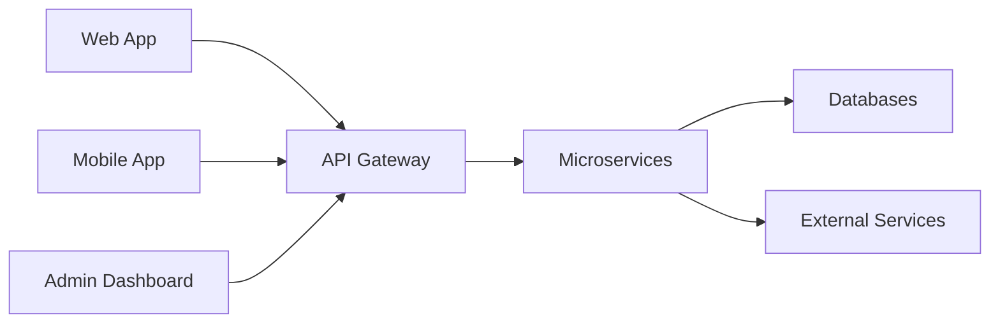

# 🛒 SRIBEESonline - E-Commerce Platform

> A modern, scalable e-commerce platform for fresh groceries and daily essentials

[](https://opensource.org/licenses/MIT)
[](https://python.org/)
[](https://fastapi.tiangolo.com/)
[](https://flutter.dev/)
[](http://makeapullrequest.com)

---

## 📖 Overview

**SRIBEESonline** is a full-featured e-commerce platform designed to provide seamless online shopping experiences for fresh groceries, organic products, and daily essentials. Built with modern technologies and best practices, it offers a scalable, maintainable, and high-performance solution.

### ✨ Key Features

- 🔐 **Secure Authentication** - JWT-based auth with social login support
- 🔍 **AI-Powered Multilingual Search** - Semantic search with Gemini embeddings supporting English, Sinhala, Tamil & Singlish
- 🛍️ **Shopping Cart** - Persistent cart with real-time price calculations
- 💳 **Multiple Payment Options** - Card, UPI, Wallet, Cash on Delivery
- 📦 **Order Tracking** - Real-time order status updates
- ⭐ **Reviews & Ratings** - Customer feedback with photo uploads
- 📊 **Admin Dashboard** - Comprehensive store management tools
- 📱 **PWA Support** - Offline capabilities and mobile-first design
- 🔔 **Multi-channel Notifications** - Email, SMS, and push notifications

---

## 📁 Project Structure

```
SRIBEESonline/
├── project_proposel          # Project EPICs and user stories
├── ARCHITECTURE.md            # Technical architecture documentation
├── README.md                  # This file
│
├── frontend/                  # Frontend applications
│   ├── web/                   # Next.js web application
│   └── admin/                 # Admin dashboard (React + Vite)
│
├── mobile/                    # Flutter mobile app
│   ├── lib/                   # Dart source code
│   ├── android/               # Android platform files
│   ├── ios/                   # iOS platform files
│   └── pubspec.yaml           # Flutter dependencies
│
├── fastapi_backend/           # Backend services (FastAPI)
│   ├── app/
│   │   ├── api/               # API routes
│   │   ├── config/            # Configuration
│   │   ├── core/              # Core utilities
│   │   ├── models/            # SQLAlchemy models
│   │   ├── schemas/           # Pydantic schemas
│   │   ├── services/          # Business logic
│   │   └── utils/             # Utilities
│   └── requirements.txt
│
├── database/                  # Database schemas and migrations
│   ├── migrations/
│   └── seeds/
│
├── infrastructure/            # DevOps and deployment configs
│   ├── docker/
│   ├── kubernetes/
│   └── terraform/
│
└── docs/                      # Additional documentation
    ├── api/                   # API documentation
    └── guides/                # Development guides
```

---

## 🎯 Project EPICs

The project is organized into 8 major EPICs:

1. **User Authentication & Account Management** - Secure user registration, login, and profile management
2. **Product Catalog & Search** - Comprehensive product browsing and search capabilities
3. **Shopping Cart & Wishlist** - Item management before purchase
4. **Checkout & Payment** - Secure and seamless checkout experience
5. **Order Management** - Order tracking and management
6. **Reviews & Ratings** - Customer feedback system
7. **Admin Dashboard** - Store management tools
8. **Notifications & Communication** - Multi-channel user notifications

📄 **See [project_proposel](file:///c:/Users/Lenovo/Desktop/SRIBEESonline/project_proposel) for detailed user stories and acceptance criteria**

---

## 🏗️ Architecture

SRIBEESonline follows a **modular monolith architecture** with:

- **Web Frontend**: Next.js (React) with Tailwind CSS
- **Admin Dashboard**: React + Vite with Ant Design
- **Mobile App**: Flutter with Dart
- **Backend**: Python FastAPI with async support
- **Databases**: PostgreSQL 15+ with pgvector (primary), Redis (cache/sessions)
- **Search**: AI-powered semantic search with Gemini embeddings + pgvector
- **API**: RESTful API with automatic OpenAPI/Swagger docs
- **Authentication**: JWT with OAuth 2.0 support
- **Payment**: Stripe/Razorpay integration
- **Deployment**: Docker + Kubernetes on AWS



📄 **See [ARCHITECTURE.md](file:///c:/Users/Lenovo/Desktop/SRIBEESonline/ARCHITECTURE.md) for detailed technical architecture**

---

## 🚀 Getting Started

### Prerequisites

- **Python** >= 3.11
- **Flutter** >= 3.x (for mobile app)
- **Node.js** >= 20.0.0 (for admin dashboard)
- **Docker** >= 24.0.0
- **PostgreSQL** >= 15
- **Redis** >= 7.0

### Installation

```bash
# Clone the repository
git clone https://github.com/yourusername/SRIBEESonline.git
cd SRIBEESonline

# Start all backend services via Docker (recommended)
docker compose up -d --build postgres_db redis_cache s3-local minio_init fastapi_backend

# Verify services are healthy
docker compose ps

# Access points:
#   FastAPI Swagger:  http://localhost:8000/docs
#   MinIO Console:    http://localhost:9001  (admin / password123)
#   Health Check:     http://localhost:8000/health
```

### Running Individual Services

```bash
# FastAPI Backend (Docker - recommended)
docker compose up -d --build fastapi_backend
docker compose logs -f fastapi_backend

# Flutter Mobile App (development)
cd mobile
flutter pub get
flutter run -d emulator-5554 -t lib/main_development.dart

# Admin Dashboard (has TypeScript errors - WIP)
cd admin
npm install
npm run dev
```

---

## 🧪 Testing

```bash
# FastAPI Backend Tests
cd fastapi_backend
pytest

# Run with coverage
pytest --cov=app

# Admin Dashboard Tests
cd admin
npm test

# Flutter Tests
cd mobile
flutter test
```

---

## 📚 Documentation

- **[Project Proposal](file:///c:/Users/Lenovo/Desktop/SRIBEESonline/project_proposel)** - EPICs, user stories, and project phases
- **[Architecture](file:///c:/Users/Lenovo/Desktop/SRIBEESonline/ARCHITECTURE.md)** - Technical architecture and system design
- **API Documentation** - Auto-generated at http://localhost:8000/docs (Swagger UI)
- **ReDoc** - Alternative docs at http://localhost:8000/redoc
- **User Guide** - (To be created)
- **Admin Guide** - (To be created)

---

## 🛠️ Technology Stack

### Web Frontend
- **Framework**: Next.js 14+, React 18+
- **State Management**: TanStack Query
- **Styling**: Tailwind CSS, shadcn/ui
- **Forms**: React Hook Form + Zod

### Admin Dashboard
- **Framework**: React 19+ with Vite
- **UI Library**: Ant Design
- **State Management**: TanStack Query
- **Charts**: Recharts

### Mobile App
- **Framework**: Flutter 3.x
- **Language**: Dart
- **State Management**: Riverpod / Provider
- **HTTP Client**: Dio
- **Local Storage**: Hive / SharedPreferences

### Backend
- **Runtime**: Python 3.11+
- **Framework**: FastAPI 0.109+
- **ASGI Server**: Uvicorn + Gunicorn
- **Language**: Python (with type hints)
- **Authentication**: python-jose (JWT) + passlib[argon2]
- **Validation**: Pydantic v2
- **ORM**: SQLAlchemy 2.0+ (async)
- **Migrations**: Alembic

### Databases
- **Primary**: PostgreSQL 15+ (asyncpg)
- **Cache/Sessions**: Redis 7+ (redis-py async)
- **Search**: Elasticsearch 8+

### DevOps
- **Containerization**: Docker
- **Orchestration**: Kubernetes
- **CI/CD**: GitHub Actions
- **Cloud**: AWS (EC2, RDS, S3, CloudFront)
- **Monitoring**: Prometheus, Grafana, New Relic

---

## 📅 Development Roadmap

### Phase 1: MVP (8-10 weeks) 🔧 In Progress
- [x] Docker infrastructure (Postgres + pgvector, Redis, MinIO, FastAPI)
- [x] Database schema (16 tables in sribees schema)
- [x] User authentication and authorization (JWT + Argon2)
- [x] Product catalog with branch-specific inventory
- [x] Splash video system (MinIO + app_settings)
- [x] Flutter mobile app launch flow (Splash → Language → Address → Home)
- [x] Android emulator connectivity (10.0.2.2 URL rewriting)
- [ ] Shopping cart functionality
- [ ] Basic checkout and payment
- [ ] Order management

### Phase 2: Enhanced Features (6-8 weeks)
- [ ] Reviews and ratings
- [ ] Admin dashboard
- [ ] Notification system
- [ ] Advanced search and filters
- [ ] Wishlist functionality

### Phase 3: Advanced Features (4-6 weeks)
- [ ] Advanced analytics
- [ ] Vendor management
- [ ] Loyalty programs
- [ ] Mobile app development
- [ ] AI-powered recommendations

---

## 🤝 Contributing

We welcome contributions! Please follow these steps:

1. Fork the repository
2. Create a feature branch (`git checkout -b feature/amazing-feature`)
3. Commit your changes (`git commit -m 'Add amazing feature'`)
4. Push to the branch (`git push origin feature/amazing-feature`)
5. Open a Pull Request

### Coding Standards
- Follow ESLint and Prettier configurations
- Write unit tests for new features
- Update documentation as needed
- Follow conventional commits

---

## 📄 License

This project is licensed under the MIT License - see the [LICENSE](LICENSE) file for details.

---

## 👥 Team

- **Product Owner**: [To be assigned]
- **Project Manager**: [To be assigned]
- **Tech Lead**: [To be assigned]
- **Development Team**: [To be assigned]

---

## 📞 Support

For support, email support@sribeesonline.com or join our Slack channel.

---

## 🙏 Acknowledgments

- Thanks to all contributors
- Inspired by modern e-commerce platforms
- Built with ❤️ using open-source technologies

---

**Version**: 2.1.0  
**Last Updated**: February 17, 2026

---

Made with ❤️ by the SRIBEESonline Team
